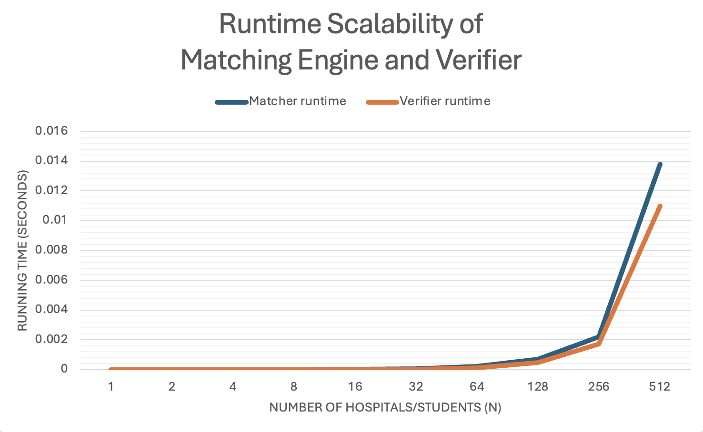

# Programming Assignment 1: Stable Matching

This project implements the hospital-proposing Gale–Shapley stable matching algorithm and a verifier that checks whether a given matching is valid and stable. The project also includes a scalability experiment that measures the runtime of the matcher and verifier for increasing input sizes.

## Authors

Carlos Felipe - UFID 70583368  
Alexis Morales - UFID 20325573  

## Task A: Matching Engine

The file matcher.py implements the hospital-proposing Gale–Shapley algorithm.  
It reads an input file containing preference lists and prints a stable matching to standard output.

### How to run the matcher

    python3 src/matcher.py data/example.in

To save the output to a file:

    python3 src/matcher.py data/example.in > data/example.out

## Task B: Verifier

The file verifier.py checks whether a given matching is:
- Valid: every hospital and student is matched exactly once.
- Stable: there is no blocking pair.

### How to run the verifier

    python3 src/verifier.py data/example.in data/example.out

Possible outputs:
   - VALID STABLE
   - INVALID: reason
   - UNSTABLE: blocking pair (h, s)

Several invalid and unstable example matchings are included in the data folder for testing.

## Task C: Scalability Analysis

The file runtime.py measures the running time of the matching engine and the verifier for increasing values of n:

    n = 1, 2, 4, 8, 16, 32, 64, 128, 256, 512

The script prints timing results, which were then used to generate the graph below.

### How to run the scalability experiment

    python3 src/runtime.py

### Runtime Graph

### Observed Trend

As the number of hospitals and students increases, the running time of both the matching engine and the verifier increases rapidly. The growth is clearly non-linear and closely resembles quadratic behavior. This matches the theoretical O(n^2) time complexity of the Gale–Shapley algorithm and the stability-checking process, since both involve nested iterations over participants.

We copied the printed timing results into Google Sheets to make the line graph.

## Assumptions

- Preference lists are complete and contain strict rankings.
- The number of hospitals equals the number of students.
